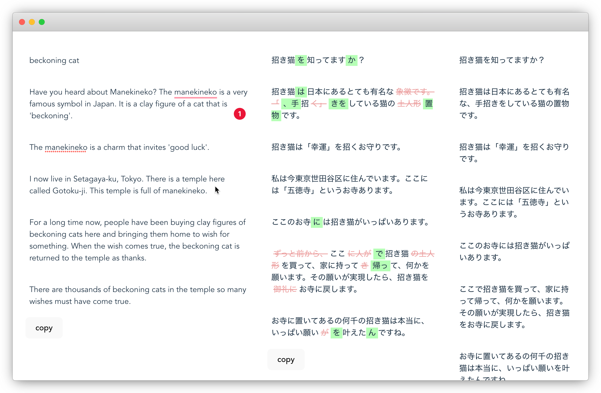

# Proof reading tool

This is a small tool for [JWriter](https://japapps.com) proof-readers to help them annotate articles with what was updated.

It as a prefilled example so you can load it just as is but, it is wired up to an Airtable backend to load articles from.

To avoid storing any sensitive data in this repo, the api key and article id is passed in through the URL. This is also far from great as it an be sniffed way too easily but, for now it will do. Later I intend to read this API key from a configuration store once a user is logged in.



## Running it

This app is built with Vue3 composition API, typescript on top of Vite. Run it with:

```
npm install
npm run dev
```

### Environment settings

To run this project, you will need to have an Airtable base setup and the settings for this base added to the `.env` file. Copy the `.env.example` to your own file to provide these to the runtime environment.

If you have access to the Vercel project, you can also pull these values to your `.env` file by using `npx vercel env pull && cp .vercel/.env.development.local .env`.

## Deployment

The app is deployed on [https://jwriter-proofing.vercel.app/](https://jwriter-proofing.vercel.app/) using Vercel.


## Contact

Reach me at [https://greycastle.se](https://greycastle.se), [linkedin](https://www.linkedin.com/in/david-dikman-52479166/) or [twitter](https://twitter.com/almundgrey)